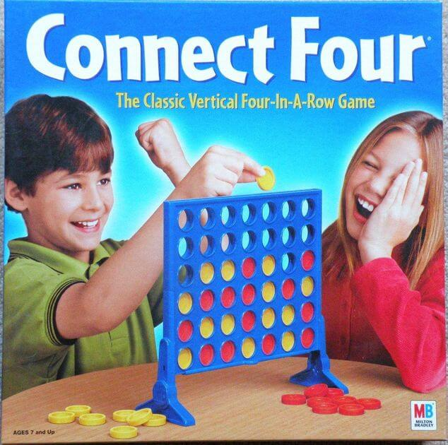

# Connect 4 Game - Projinda

## Authors: Viktor Luthman, Jakob Kratz

## Introduction
Connect 4 is a two-player turn based connection game. The game has been implemented in Python 3 and can be played versus the computer or versus another player. The game can be played either in the terminal or in a simple graphical user interface.



## Installation Guide
1. Clone the repository
    ```
    git clone git@gits-15.sys.kth.se:vluthman/Projinda
    ```
2. Move into the code directory
    ```
    cd Projinda/src
    ```
3. Install the dependencies
    ```
    pip install -r requirements.txt
    ```
4. Play the game (Requires Python 3)
        
    * Using the terminal
        ```
            python play.py
        ```
    * Using the graphical user interface
        ```
            python playgui.py
        ```

## More about the game

### The game
The game board is represented by a 6x7 matrix. Player 1 and Player 2's disks are represented with the number 1 and 2 in the terminal and by yellow and red circles in the graphical user interface. Empty slots are represented by the number 0 in the terminal and by nothing in the graphical user interface. The first player to have 4 disks in connection wins.

The game has a replay function which allows rewatching the previous game. This feature only works while playing the game in the terminal.

### The bot
The bot uses a recursive [minimax](https://en.wikipedia.org/wiki/Minimax) algorithm to find good moves. To improve the search depth of this algorithm [Alpha-beta pruning](https://en.wikipedia.org/wiki/Alpha%E2%80%93beta_pruning) is used. The bot currently thinks 5 moves ahead, which makes it very hard to play against.


## How to play
The default mode is to play against a bot. You make the first move and then the bot makes its move. If you instead want to play against a friend you can write ```python play.py nobot``` or ```python playgui.py nobot```.

### Using the terminal
To make a move you simply type in the number of the column (0-6) you want to place your marker in. Note that you cannot place a marker in a full column.

After a game has ended you get two options. If you write 1 you restart the game and play again. If you write 2 you can watch a replay of the game. To view the next move of the replay you write 1 untill the replay has ended.

### Using the graphical user interface
To make a move you simply click inside the column of the board you want to place a disc. Note that you cannot place a marker in a full column.

To restart the game you can click the button on the bottom of the window which says "Reset game".

## Minimax and alpha-beta pruning

### Minimax 

The minimax algorithm is used to make intelligent decisions in our game. It tries to maximize the guaranteed gain of a move. In other words it tries to maximize the minimum gain of a move or minimize the maximum loss of a move. The algorithm is recursive and simulates a decision tree of different moves. At the bottom of the decision tree the state of the game is evaluated and assigned a score reflecting how good the game state is for some player. The algorithm works depth first. 

At each step of the decision tree the player which is going to make a move either wants to maximize the score at the bottom of the tree or minimize it. 

The first player wants to maximize the score at the bottom of the tree while the opponent wants to minimize it. At each step of the decision tree the bot will alternate between simulating the first player's and the oponent's moves. So in each step of the decision tree the algorithm will alternate between trying to maximize and minimize the score. 

When the algorithm has reached the end of its search depth it evaluates the game state and returns its score. That score will then be compared to the scores of other possible moves the current player can make. If it is the maximizing player the player will pick the the best scoring move, else it will choose the worst scoring move. Then after chosing between these moves the algorithm returns the best or worst score (depending on player). This will continue all the way upp to the initial call to the algorithm and the best scoring move will be picked.


A small example (in this case the algorithm would chose to make the right move)

```
maximizing:        7
                 /   \
minimizing:     3     7
               / \   / \
              3   5 7  10
```


Pseudo code for the algorithm
```
function minimax(node, depth, maximizingPlayer) is
    if depth = 0 or node is a terminal node then
        return the heuristic value of node
    if maximizingPlayer then
        value := −∞
        for each child of node do
            value := max(value, minimax(child, depth − 1, FALSE))
        return value
    else (* minimizing player *)
        value := +∞
        for each child of node do
            value := min(value, minimax(child, depth − 1, TRUE))
        return value
```

The initial call to the method will be
```
minimax(origin, depth, TRUE)
```

### Alpha-beta pruning

Alpha-beta pruning is a way to effectivise the minimize algorithm by avoiding doing evaluations that are guaranteed to be unnecessary. This will enable greater search depths and therefore a better playing bot. 

In the example below p1 is the maximizing player and can chose between two moves. The left move is guaranteed at least the score 3. The search in the right move has not yet been done, the score x has not yet been evaluated. But its value will not affect p1:s choice. The opponent will get to make the next move and will minimize the score. As we can see the opponent can chose to go left and get the score 2. So the play the opponent makes will result in a score that is at most 2 which is less than the score that p1 gets by choosing the left move. Therefore, p1 will never pick the right move regardless of the value of x. By using this reasoning whole branches can be cut off.


```
 maximizing:       p1
                 /    \
 minimizing:    3     ≥2
                     /   \
                    2     x
```

The earlier psuedo code only requires slight modifications to use the alpha-beta pruning

```
function alphabeta(node, depth, α, β, maximizingPlayer) is
    if depth = 0 or node is a terminal node then
        return the heuristic value of node
    if maximizingPlayer then
        value := −∞
        for each child of node do
            value := max(value, alphabeta(child, depth − 1, α, β, FALSE))
            α := max(α, value)
            if α ≥ β then
                break (* β cut-off *)
        return value
    else
        value := +∞
        for each child of node do
            value := min(value, alphabeta(child, depth − 1, α, β, TRUE))
            β := min(β, value)
            if α ≥ β then
                break (* α cut-off *)
        return value
```

The initial call to the method would be

```
alphabeta(origin, depth, −∞, +∞, TRUE)
```